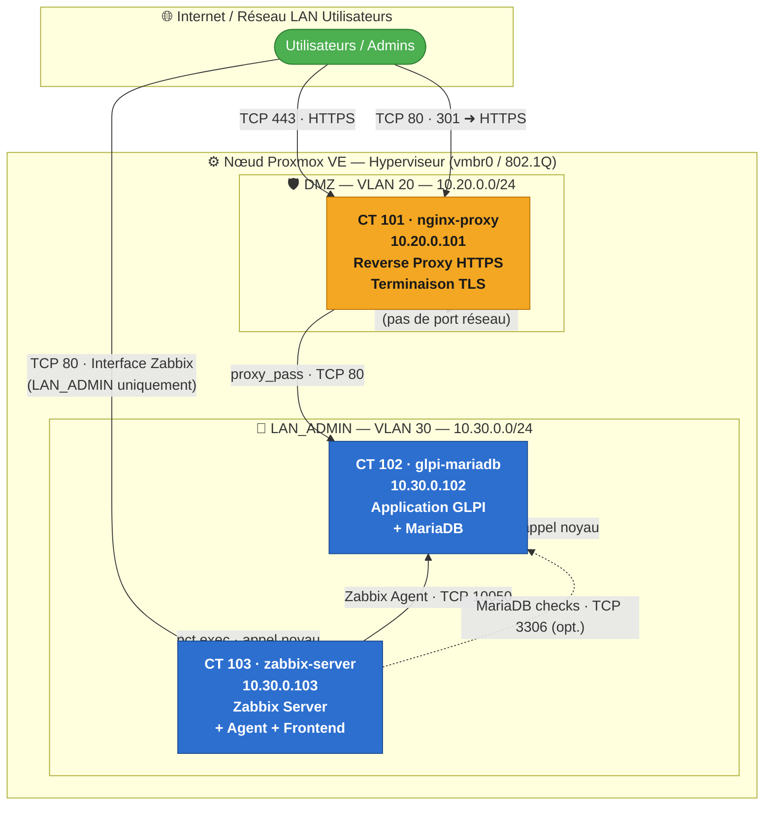

# Dossier d'Architecture Technique (DAT) — Projet Atlas

| Champ         | Valeur                                      |
|---------------|---------------------------------------------|
| **Projet**    | Atlas — Portail de ticketing interne (GLPI) |
| **Version**   | 1.0                                         |
| **Date**      | 2026-05-26                                  |
| **Auteur**    | `<auteur>`                                  |
| **Statut**    | Draft                                       |

### Historique des révisions

| Version | Date       | Description        | Auteur      |
|---------|------------|--------------------|-------------|
| 1.0     | 2026-05-26 | Création initiale  | `<auteur>`  |

---

## 1. Présentation du projet

Le projet Atlas consiste à déployer une infrastructure de ticketing interne de type GLPI à destination des équipes support d'une organisation. L'ensemble de la chaîne — de l'hyperviseur jusqu'à l'application — est conçu selon une approche **Infrastructure as Code (IaC)** : aucune opération manuelle non tracée n'est autorisée. Chaque composant est provisionné par un script versionné dans Git.

Les contraintes de Plan de Reprise d'Activité (PRA) imposent un **RPO ≤ 20 minutes** et un **RTO ≤ 40 minutes**. Ces objectifs sont couverts respectivement par un dump MariaDB automatisé toutes les 15 minutes et par la capacité à re-provisionner l'intégralité de l'infrastructure en moins de 40 minutes à partir du dépôt Git et du dernier dump de sauvegarde.

La plateforme d'hébergement est **Proxmox VE** (hyperviseur de type 1 basé sur KVM/LXC). Les services applicatifs s'exécutent dans des **conteneurs LXC non-privilégiés** répartis sur deux zones réseau distinctes : une DMZ (VLAN 20) pour l'exposition publique, et un réseau LAN_ADMIN (VLAN 30) pour les services internes.

---

## 2. Topologie réseau

### 2.1 Schéma d'architecture



### 2.2 Plan d'adressage IP et VLAN

| CTID | Hostname         | Zone       | VLAN | Adresse IP        | Passerelle   | Rôle principal                       |
|------|------------------|------------|------|-------------------|--------------|--------------------------------------|
| 101  | `nginx-proxy`    | DMZ        | 20   | `10.20.0.101/24`  | `10.20.0.1`  | Reverse proxy HTTPS, terminaison TLS |
| 102  | `glpi-mariadb`   | LAN_ADMIN  | 30   | `10.30.0.102/24`  | `10.30.0.1`  | Application GLPI + base MariaDB      |
| 103  | `zabbix-server`  | LAN_ADMIN  | 30   | `10.30.0.103/24`  | `10.30.0.1`  | Supervision Zabbix (serveur + agent) |

- **Résolveur DNS interne :** `10.30.0.1`
- **Domaine de recherche :** `atlas.internal`
- **FQDN portail helpdesk :** `helpdesk.atlas.internal`
- **URL supervision :** `http://10.30.0.103/zabbix` (accessible depuis LAN_ADMIN uniquement)

### 2.3 Configuration réseau Proxmox

L'hyperviseur expose un unique bridge Linux `vmbr0` configuré en mode trunk **802.1Q**. Chaque conteneur LXC est rattaché à ce bridge avec un tag VLAN dédié via le paramètre `--net0` de la commande `pct create` :

```
--net0 "name=eth0,bridge=vmbr0,tag=<VLAN>,ip=<IP>,gw=<GW>,firewall=1"
```

L'isolation entre VLAN 20 (DMZ) et VLAN 30 (LAN_ADMIN) est assurée au niveau du commutateur physique ou virtuel (OPNsense/pfSense en routeur inter-VLAN). Le paramètre `firewall=1` active le pare-feu intégré de Proxmox sur chaque interface de conteneur.

---

## 3. Stack applicative

### CT 101 — nginx-proxy (DMZ, VLAN 20)

| Composant   | Version          | Rôle                                              |
|-------------|------------------|---------------------------------------------------|
| Nginx       | `stable-alpine`  | Reverse proxy, terminaison TLS, rate limiting     |
| OpenSSL     | (inclus Debian)  | Génération du certificat TLS auto-signé interne   |

### CT 102 — glpi-mariadb (LAN_ADMIN, VLAN 30)

| Composant   | Version   | Rôle                                    |
|-------------|-----------|-----------------------------------------|
| Apache2     | 2.4.x     | Serveur HTTP pour GLPI (port 80 local)  |
| PHP         | 8.2.x     | Runtime GLPI (extensions : mysql, xml, curl, gd, mbstring, zip, intl, ldap) |
| MariaDB     | 10.11.x   | Base de données GLPI                    |
| GLPI        | 10.0.15   | Application de ticketing                |

### CT 103 — zabbix-server (LAN_ADMIN, VLAN 30)

| Composant        | Version  | Rôle                                          |
|------------------|----------|-----------------------------------------------|
| Zabbix Server    | 7.0      | Collecte et traitement des métriques          |
| Zabbix Agent     | 7.0      | Auto-monitoring du conteneur CT 103           |
| Zabbix Frontend  | 7.0      | Interface web (Apache2 + PHP)                 |
| MariaDB          | 10.11.x  | Base de données Zabbix                        |

---

## 4. Flux réseau et règles de pare-feu

### 4.1 Matrice des flux autorisés

| Source                        | Destination                  | Port / Protocole      | Sens | Justification                                    |
|-------------------------------|------------------------------|-----------------------|------|--------------------------------------------------|
| Internet / LAN utilisateurs   | `10.20.0.101` (CT 101)       | `TCP 443` (HTTPS)     | →    | Accès au portail helpdesk GLPI                   |
| Internet / LAN utilisateurs   | `10.20.0.101` (CT 101)       | `TCP 80` (HTTP)       | →    | Redirection `301 → HTTPS` uniquement, aucun contenu |
| `10.20.0.101` (CT 101)        | `10.30.0.102` (CT 102)       | `TCP 80` (HTTP)       | →    | `proxy_pass` Nginx → Apache2 GLPI                |
| `10.30.0.103` (CT 103)        | `10.30.0.102` (CT 102)       | `TCP 10050`           | →    | Collecte Zabbix Agent (métriques CT 102)         |
| `10.30.0.103` (CT 103)        | `10.30.0.102` (CT 102)       | `TCP 3306` (optionnel)| →    | Vérifications MariaDB par Zabbix                 |
| LAN_ADMIN (admins)            | `10.30.0.103` (CT 103)       | `TCP 80` (HTTP)       | →    | Interface web Zabbix (LAN_ADMIN uniquement)      |
| Nœud Proxmox (host)           | CT 101, CT 102, CT 103       | `pct exec` (noyau)    | →    | Provisionnement IaC — pas de port réseau exposé  |
| **BLOQUÉ**                    | `10.20.0.0/24 → 10.30.0.0/24` (sauf CT101→CT102:80) | Tout | ✗ | Isolation stricte DMZ / LAN_ADMIN              |
| **BLOQUÉ**                    | Internet → `10.30.0.0/24`    | Tout                  | ✗    | LAN_ADMIN non routable depuis l'extérieur        |
| **BLOQUÉ**                    | Internet → CT 103            | `TCP 80`              | ✗    | Zabbix accessible LAN_ADMIN uniquement           |

### 4.2 Principe d'isolation DMZ / LAN_ADMIN

CT 101 (`nginx-proxy`) constitue le **seul point de traversée autorisé** entre la DMZ (VLAN 20) et le LAN_ADMIN (VLAN 30). Toute tentative d'accès direct depuis la DMZ vers le LAN_ADMIN — autre que le flux `10.20.0.101 → 10.30.0.102:80` — doit être explicitement rejetée par le pare-feu inter-VLAN.

Cette architecture garantit que la compromission du reverse proxy (zone exposée) ne donne pas d'accès direct au niveau réseau à la base de données MariaDB (port `3306`), aux fichiers GLPI, ou à l'interface Zabbix. L'attaquant ne peut atteindre CT 102 que via le seul vecteur contrôlé : la connexion HTTP sur le port 80, filtrée et journalisée par Nginx.

---

## 5. Sécurité et durcissement

### 5.1 Conteneurs non-privilégiés (LXC unprivileged)

Tous les conteneurs sont créés avec l'option `--unprivileged 1`. Ce mode active le **décalage d'espace de noms UID/GID (user namespace remapping)** : l'UID `0` (root) à l'intérieur du conteneur est mappé sur un UID non-privilégié du système hôte (typiquement `100000`). En conséquence, même si un processus parvient à s'échapper du conteneur, il atterrit sur l'hôte Proxmox sans aucun privilège.

La nestification (`--features nesting=0`) est désactivée sur tous les conteneurs pour réduire la surface d'attaque au niveau du noyau. La protection contre la suppression accidentelle est activée via `pct set <CTID> --protection 1`.

### 5.2 Authentification et gestion des secrets

**Authentification SSH** : une paire de clés `ed25519` est générée par l'opérateur sur son poste (`ssh-keygen -t ed25519 -f ~/.ssh/atlas_id_ed25519`) et injectée dans chaque conteneur au moment de la création via `--ssh-public-keys`. L'option `--password ""` désactive explicitement tout mot de passe root — l'authentification par clé est le seul vecteur d'accès.

**Secrets applicatifs** : aucun mot de passe, certificat ou clé privée n'est commité dans le dépôt Git. Les credentials de bases de données sont transmis aux scripts via des variables d'environnement exportées par l'opérateur (`export GLPI_DB_PASSWORD=…`), capturées de manière non-traçable avec `read -sr` pour éviter toute inscription dans l'historique du shell.

**Règles `.gitignore`** :

```
.env          # Variables d'environnement
.env.*
*.crt         # Certificats TLS
*.key         # Clés privées
*.pem
certs/        # Répertoires de secrets
secrets/
```

> **Note :** Toute violation de cette politique (commit accidentel d'un secret) doit déclencher une rotation immédiate de la clé ou du mot de passe concerné. Un historique Git ne doit jamais être considéré comme privé.

### 5.3 Durcissement Nginx (CT 101)

| Mesure                     | Configuration                                                                 |
|----------------------------|-------------------------------------------------------------------------------|
| Masquage de version        | `server_tokens off`                                                           |
| Protocoles TLS             | `TLSv1.2 TLSv1.3` uniquement — SSLv3, TLS 1.0 et 1.1 désactivés             |
| Suite de chiffrement       | ECDHE + AES-256-GCM / ChaCha20-Poly1305 (AEAD, Perfect Forward Secrecy)     |
| HSTS                       | `Strict-Transport-Security: max-age=31536000; includeSubDomains`              |
| Rate limiting              | `limit_req_zone` — 30 req/min par IP source, burst 10 `nodelay`              |
| En-têtes de sécurité       | `X-Frame-Options: SAMEORIGIN`, `X-Content-Type-Options: nosniff`, `Referrer-Policy: no-referrer-when-downgrade` |
| Capacités Linux            | `cap_drop: ALL` + `cap_add: NET_BIND_SERVICE` (mode Docker)                  |
| Endpoint de santé          | `GET /health → 200 OK` (non proxyfié, utilisé par Zabbix et Docker)          |

### 5.4 Comptes de service et base de données

| Compte                     | Type             | Privilèges                                              | Portée              |
|----------------------------|------------------|---------------------------------------------------------|---------------------|
| `root` MariaDB             | Système          | Accès via `unix_socket` uniquement — pas de mot de passe MySQL | Hôte local     |
| `glpiuser`@`localhost`     | Applicatif       | `ALL PRIVILEGES ON glpidb.*` — pas de `GRANT OPTION`, pas de `SUPER` | Base `glpidb` |
| `zabbixuser`@`localhost`   | Applicatif       | `ALL PRIVILEGES ON zabbixdb.*`                          | Base `zabbixdb`     |
| `www-data`                 | OS (Apache2)     | Propriétaire des fichiers GLPI (`755`/`644`)            | `/var/www/html/glpi`|
| `glpi_backup`              | OS (cron)        | Exécution de `dump_mariadb.sh` uniquement               | Hôte CT 102         |
| `zabbix`                   | OS (service)     | Exécution du démon `zabbix_server` et `zabbix_agentd`   | Hôte CT 103         |

L'authentification `unix_socket` de MariaDB garantit que le compte `root` MySQL ne possède pas de mot de passe : seul le processus OS `root` peut ouvrir une session, ce qui élimine le vecteur d'attaque par force brute sur le port `3306`.

### 5.5 Certificats TLS

Le certificat TLS de CT 101 est généré **à l'intérieur du conteneur** via `pct exec` et la commande `openssl req -x509 -nodes -newkey rsa:4096`. La clé privée (`/etc/ssl/private/nginx-selfsigned.key`, permissions `600`) ne quitte jamais CT 101 — elle n'est ni transmise sur le réseau ni stockée sur le poste opérateur.

Des liens symboliques sont créés dans `/etc/nginx/certs/` pour que le fichier `nginx.conf` puisse référencer des chemins stables :

```
/etc/nginx/certs/privkey.pem    → /etc/ssl/private/nginx-selfsigned.key
/etc/nginx/certs/fullchain.pem  → /etc/ssl/certs/nginx-selfsigned.crt
```

> **Note (Production) :** Le certificat auto-signé doit être remplacé par un certificat émis par la PKI interne de l'organisation ou par Let's Encrypt avant toute mise en production. La procédure consiste à mettre à jour les deux liens symboliques et à exécuter `systemctl reload nginx` dans CT 101 — aucune modification du fichier `nginx.conf` n'est nécessaire.

---

## 6. Infrastructure as Code — Inventaire des scripts

| Fichier                                        | Cible          | Description                                                                      | Outil principal     |
|------------------------------------------------|----------------|----------------------------------------------------------------------------------|---------------------|
| `infra/proxmox_iac/deploy_lxc.sh`             | Nœud Proxmox   | Création des 3 conteneurs LXC non-privilégiés avec injection de clé SSH          | `pct create`        |
| `infra/dmz_vlan20/provision_nginx.sh`         | CT 101         | Installation Nginx + génération TLS auto-signé + déploiement `nginx.conf`        | `pct exec`, `pct push` |
| `infra/dmz_vlan20/nginx.conf`                 | CT 101         | Configuration Nginx : TLS, rate limiting, HSTS, proxy_pass                       | —                   |
| `infra/dmz_vlan20/docker-compose.yml`         | CT 101 (alt.)  | Stack Docker Nginx avec durcissement (`cap_drop`, volumes en lecture seule)       | `docker compose`    |
| `infra/lan_admin_vlan30/provision_glpi.sh`    | CT 102         | Installation LAMP + GLPI 10.0.15 + configuration MariaDB (credentials via env)   | `pct exec`          |
| `infra/lan_admin_vlan30/provision_zabbix.sh`  | CT 103         | Installation Zabbix 7.0 + MariaDB + configuration `zabbix_server.conf`           | `pct exec`          |
| `scripts_pra/backup/dump_mariadb.sh`          | CT 102 (cron)  | Dump MariaDB compressé (gzip) toutes les 15 min, rotation 48 h, log Zabbix       | `mysqldump`, `cron` |

Chaque script respecte les principes suivants : `set -euo pipefail`, bloc de configuration centralisé en tête de fichier, aucun secret en dur, vérifications de prérequis avant toute action sur l'infrastructure.

---

## 7. Plan de Reprise d'Activité (PRA)

### 7.1 Objectifs RPO / RTO

| Indicateur | Valeur    | Mécanisme                                                        |
|------------|-----------|------------------------------------------------------------------|
| **RPO**    | ≤ 20 min  | `dump_mariadb.sh` planifié toutes les `*/15 * * * *` via cron   |
| **RTO**    | ≤ 40 min  | Re-provisionnement complet via les scripts IaC depuis le dépôt Git |

### 7.2 Procédure de reprise

En cas de perte totale du nœud Proxmox, la procédure de reprise est la suivante :

1. **Provisionner un nouveau nœud Proxmox** sur un hôte Debian 12 vierge.
2. **Cloner le dépôt Git** sur le nouveau nœud :
   ```bash
   git clone <url-depot> /root/atlas
   ```
3. **Télécharger le template Debian 12** sur le stockage local Proxmox :
   ```bash
   pveam update && pveam download local debian-12-standard_12.7-1_amd64.tar.zst
   ```
4. **Générer la clé SSH opérateur** (ou restaurer la clé existante depuis un coffre-fort) :
   ```bash
   ssh-keygen -t ed25519 -f ~/.ssh/atlas_id_ed25519
   ```
5. **Créer les conteneurs LXC** :
   ```bash
   bash /root/atlas/infra/proxmox_iac/deploy_lxc.sh
   ```
6. **Démarrer les conteneurs** et exécuter les scripts de provisionnement :
   ```bash
   pct start 101 && pct start 102 && pct start 103
   bash /root/atlas/infra/dmz_vlan20/provision_nginx.sh
   export GLPI_DB_NAME=glpidb GLPI_DB_USER=glpiuser
   read -srp "GLPI DB password: " GLPI_DB_PASSWORD && export GLPI_DB_PASSWORD
   bash /root/atlas/infra/lan_admin_vlan30/provision_glpi.sh
   export ZABBIX_DB_NAME=zabbixdb ZABBIX_DB_USER=zabbixuser
   read -srp "Zabbix DB password: " ZABBIX_DB_PASSWORD && export ZABBIX_DB_PASSWORD
   bash /root/atlas/infra/lan_admin_vlan30/provision_zabbix.sh
   ```
7. **Restaurer le dernier dump GLPI** depuis le stockage de sauvegarde :
   ```bash
   zcat /var/backups/glpi/glpi_backup_<YYYYMMDD_HHMMSS>.sql.gz \
     | mysql -u glpiuser -p glpidb
   ```
8. **Valider la reprise** :
   ```bash
   curl -sk https://helpdesk.atlas.internal/health   # attendu : 200 OK
   curl -s  http://10.30.0.103/zabbix                # attendu : page de login Zabbix
   ```

### 7.3 Stratégie de sauvegarde

Le script `scripts_pra/backup/dump_mariadb.sh` réalise un dump compressé (`mysqldump | gzip -9`) de la base GLPI dans `/var/backups/glpi/` selon le format `glpi_backup_YYYYMMDD_HHMMSS.sql.gz`. Les options `--single-transaction --quick --lock-tables=false` garantissent la cohérence du dump sur tables InnoDB sans interrompre l'accès applicatif.

La rotation supprime automatiquement les fichiers de plus de 48 heures (`find -mtime +2 -delete`). Chaque exécution inscrit une ligne horodatée dans `/var/log/glpi/backup.log` au format `[YYYY-MM-DD HH:MM:SS] SUCCESS — <fichier>` ou `FAIL — <motif>`, consommable directement par un item de surveillance Zabbix.

---

## 8. Supervision Zabbix

Les éléments de surveillance suivants doivent être configurés dans l'interface Zabbix (`http://10.30.0.103/zabbix`) après provisionnement :

| Hôte cible | Type d'item                | Clé / URL                                    | Seuil d'alerte             |
|------------|----------------------------|----------------------------------------------|----------------------------|
| CT 101     | Zabbix Agent — ping        | `agent.ping`                                 | Pas de réponse → Critique  |
| CT 101     | HTTP check                 | `https://10.20.0.101/health` (port 443)      | Code ≠ 200 → Haute         |
| CT 102     | Zabbix Agent — ping        | `agent.ping`                                 | Pas de réponse → Critique  |
| CT 102     | Log monitoring             | `log[/var/log/glpi/backup.log,FAIL]`         | Correspondance → Haute     |
| CT 102     | Métriques MariaDB          | `mysql.status[Threads_connected]`            | > 100 → Avertissement      |
| CT 101–103 | Métriques système          | `system.cpu.util`, `vm.memory.size[pavailable]`, `vfs.fs.size[/,pused]` | CPU > 85 %, RAM < 10 %, Disque > 85 % → Haute |

> **Note :** L'agent Zabbix doit être installé dans CT 101 et CT 102 pour permettre la collecte des métriques système. Le script `provision_zabbix.sh` installe l'agent uniquement dans CT 103 (auto-monitoring). L'installation dans CT 101 et CT 102 est à intégrer aux scripts de provisionnement correspondants lors de la prochaine itération.

---

## 9. Conclusion

Le projet Atlas livre une infrastructure de ticketing interne entièrement pilotée par le code : sept scripts versionnés couvrent la création des conteneurs LXC, l'installation et la configuration des services applicatifs, et la stratégie de sauvegarde. Aucune opération manuelle non tracée n'a été réalisée. Le respect des objectifs PRA (RPO ≤ 20 min, RTO ≤ 40 min) est démontrable et reproductible sur tout nœud Proxmox Debian 12.

Pour une mise en production, les axes de renforcement prioritaires sont : le remplacement du certificat TLS auto-signé par un certificat émis par une PKI interne ou Let's Encrypt, la mise en place d'un mécanisme de haute disponibilité (HAProxy + VRRP pour le reverse proxy, réplication MariaDB), la configuration des canaux d'alerte Zabbix (e-mail, webhook), et l'intégration d'un vault de secrets (HashiCorp Vault ou Bitwarden Secrets Manager) pour éliminer la manipulation manuelle des variables d'environnement lors des opérations de reprise.
